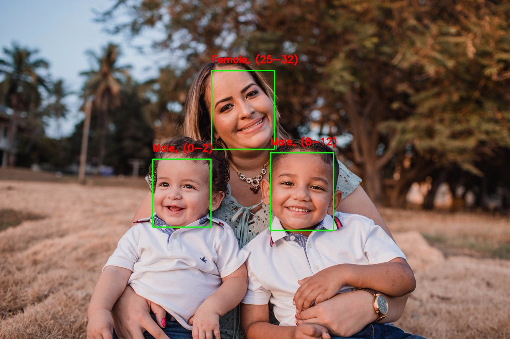

# Age & Gender Detection
A computer can predict your age and gender with very high accuracy!

The full tutorial can be found [here](https://learnopencv.com/age-gender-classification-using-opencv-deep-learning-c-python/)

# How to Run the Code

1. Navigate to this directory `cd "Age & Gender Detection"`

2. Download the necessary models:

   - Gender Net: https://www.dropbox.com/s/iyv483wz7ztr9gh/gender_net.caffemodel?dl=0"
  
   - Age Net: https://www.dropbox.com/s/xfb20y596869vbb/age_net.caffemodel?dl=0"


3. Place the downloaded models in the current folder (Age & Gender Detection)


4. Then, run:

```
python AgeGender.py --input <input_file>(Leave blank for webcam)
```

**5. Press 'Q' to exit the program**


## Sample Result



